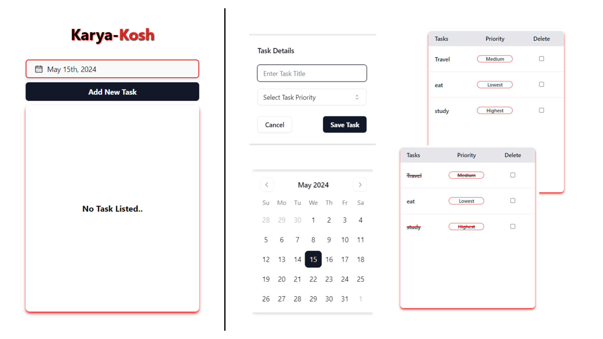

# Karya Kosh

## [Visit Website Here..](https://karya-kosh.vercel.app/)

## Project Overview

Welcome to the Karya Kosh repository! This project is designed to boost productivity for students, developers, and professionals by providing a user-friendly platform to list, manage, and track daily tasks effectively. With intuitive features and a clean interface, organizing your tasks has never been easier.

## Features

- **Task Listing**: Easily list your daily tasks with a simple interface.
- **Task Completion**: Check off completed tasks to keep track of your progress.
- **Task Removal**: Remove tasks that are no longer relevant or necessary.
- **Calendar Integration**: View and manage tasks based on a dynamic calendar interface.
- **Data Persistence**: Utilizes local storage for seamless data retention across sessions.
- **Responsive Design**: Ensures a consistent and enjoyable experience across various devices.

## Previews

## Technologies Used

- **React JS**: A powerful JavaScript library for building user interfaces.
- **Tailwind CSS**: A utility-first CSS framework for rapid UI development.
- **Shadcn**: *Note: Please specify which library or framework this is.*
- **Vite**: A fast, modern bundler for JavaScript and CSS.
- **Local Storage**: Utilized for storing task data locally within the browser.

## Installation

To get started with Karya Kosh, follow these simple steps:

1. Clone the repository to your local machine.

    `git clone https://github.com/your-username/karya-kosh.git`

2. Navigate to the project directory.

    `cd karya-kosh`

3. Install dependencies using your preferred package manager.

    `npm install`

4. Start the development server.

    `npm run dev`

5. Begin listing, managing, and tracking your tasks effortlessly!

## Contributing

Contributions are welcome! If you'd like to contribute to Task Manager, please follow these guidelines:

1. Fork the repository and create your branch from `main`.
2. Make your changes and ensure they adhere to the project's coding style and guidelines.
3. Test your changes thoroughly.
4. Submit a pull request detailing the changes you've made.

## License

This project is licensed under the [MIT License](LICENSE.txt).

---

[**Karya Kosh**](https://karya-kosh.vercel.app) is created and maintained with ❤️ by [Abhishek Singh](https://github.com/ABHISHEK-SIN-GH). Feel free to reach out with any questions, feedback, or suggestions!
